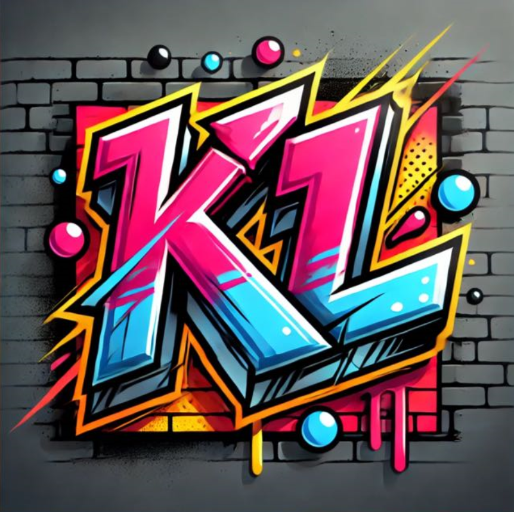

# Kl (Kings Of Logic) Bot

  

A whatsapp bot designed for the Kings Of Logic clan for group utilities, member and tournament management and more.
Made with passion and love for the game and coding.

# Features
- Full Command System Discord-Like with "!" as default prefix
- Group Management
- Full roles and permissions system
- Tournament Management
  - Creation
  - Deletion
  - Registration
  - Subscriptions
  - Match Planning
  - Match Management
- Member Management

# Why?
I've made other bots-like for telegram and discord but I haven't seen any
open framework or tools to make whatsapp bots properly, thanks to facebook to make difficult it's
bot making community without any open source tools and pay walls for business only.
So i wanted to make a whattsapp full customizable and useful open source bot for whatsapp as a bet and challenge (for fun);

# Tools used
- Baileys Library 
- NodeJS
  - tsx (The best typescript runner out there at the time writing this README)
- And primarily Typescript
- Jest (Testing)

# Acknowledgments
Thanks to the original admins and moderators of Kings Of Logic clan to let me help them with this project and for accepting me
as a former member of the clan.
And primarly to Baileys library and tsx to make this nodejs development less painful.

  

Feel free to make contributions to the project if you want to. So pull requests are welcome!

# License
MIT License
It's open source, feel free to fork this, copy it or whathever. I'd love to receive some credit but it's totally opcional 🦊

# Notes
I know the Sqlite database it's here but its for facility, then im gonna expand it to a bigger database probably in the future.
